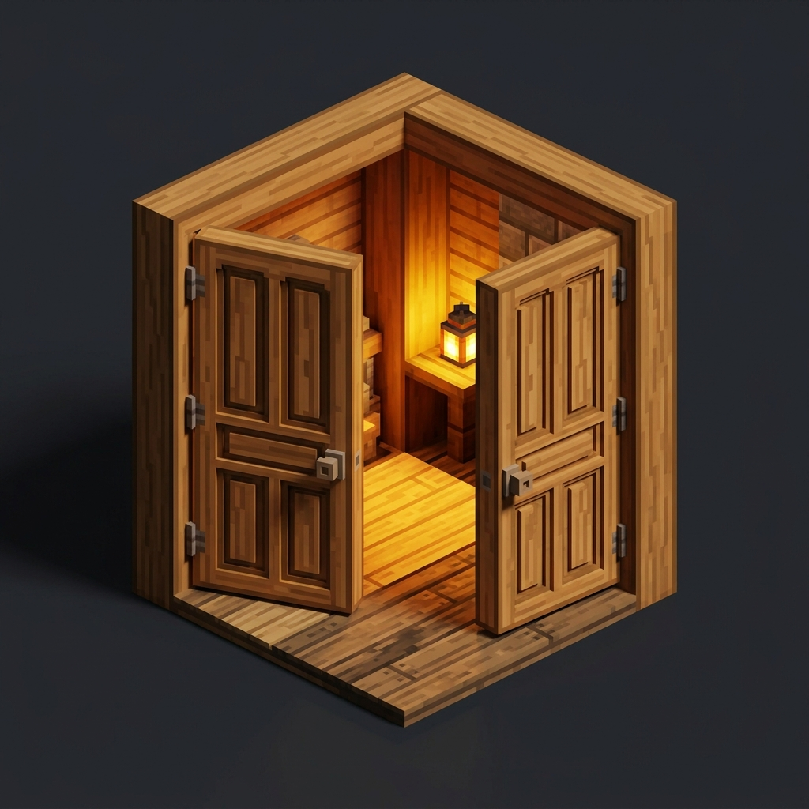

# Smart Double Doors 🚪

**Smart Double Doors** automatically syncs double door pairs - open one door and its matching partner opens too. Close one and both close. No redstone required!

From the creator of [Bigger Ender Chest](https://modrinth.com/mod/bigger-ender-chest), [Bigger Shulker Boxes](https://modrinth.com/mod/bigger-shulker-boxes), and [Fair Totem](https://modrinth.com/mod/fair-totem).

---

## Features

- **Automatic Sync**: Opening or closing one door of a double door pair instantly toggles the other.
- **Smart Detection**: Only syncs matching door pairs (same block type, opposite hinges, same facing direction).
- **All Door Types**: Works with Oak, Spruce, Birch, Jungle, Acacia, Dark Oak, Mangrove, Cherry, Bamboo, Crimson, Warped, Copper, and all other door variants.
- **No Redstone Needed**: Pure interaction-based. No contraptions required.
- **Server Safe**: Runs server-side with proper recursion protection.
- **Zero Config**: Install and forget.

---

## Installation

1. Install [Fabric Loader](https://fabricmc.net/use/installer/) for Minecraft Java Edition.
2. Download **Smart Double Doors** `.jar` from [Modrinth](https://modrinth.com/mod/smart-double-doors) or [GitHub Releases](https://github.com/antaripnandi/smart-double-doors/releases).
3. Place the `.jar` file into your `.minecraft/mods` folder.
4. Launch the game and enjoy synchronized double doors!

---

## License

Available under the [MIT License](LICENSE).
